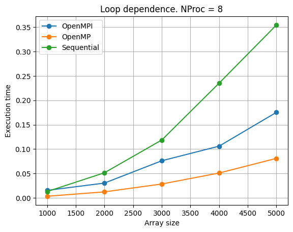

# Распараллеливание циклов с использованием OpenMP и OpenMPI

Данный проект посвящен исследованию методов распараллеливания циклов с учетом двух типов зависимости данных:
1. **Циклы без зависимости по данным между итерациями (loop-independent dependence)**.
2. **Циклы с зависимостью по данным между итерациями**.

Для реализации и анализа производительности используются технологии **OpenMP** и **OpenMPI**.

---

## 🚀 Используемые технологии

### 1. **OpenMP**
   - Модель параллельного программирования с использованием разделяемой памяти.
   - Поддерживает параллелизацию циклов и задач с помощью директив компилятора.
   - Эффективен в системах с многопоточностью.

### 2. **OpenMPI**
   - Модель параллельного программирования с использованием распределенной памяти.
   - Подходит для высокопроизводительных вычислений на кластерах.
   - Основан на стандарте **MPI (Message Passing Interface)** для обмена сообщениями между процессами.

---

## Построение графиков и анализ
Информация о процессоре, на котором проводились измерения:
```
Architecture:                    x86_64
CPU op-mode(s):                  32-bit, 64-bit
Byte Order:                      Little Endian
Address sizes:                   39 bits physical, 48 bits virtual
CPU(s):                          16
Thread(s) per core:              2
Core(s) per socket:              8
Model name:                      11th Gen Intel(R) Core(TM) i7-11800H @ 2.30GHz
simple synth:                    Intel Core (Tiger Lake) [Willow Cove], 10nm
L1d cache:                       384 KiB
L1i cache:                       256 KiB
L2 cache:                        10 MiB
L3 cache:                        24 MiB
```

- Построены графики ускорения (speedup) для циклов без зависимости по данным с использованием OpenMP и OpenMPI.


- Проведен сравнительный анализ производительности и масштабируемости каждой технологии при различных размерах буфера для циклов с зависимостью по данным.



---

## Как запустить

1. Установите необходимые библиотеки:
   - Для **OpenMP** убедитесь, что ваш компилятор поддерживает директивы `#pragma omp`.
   - Для **OpenMPI** установите библиотеку `OpenMPI`.

2. Соберите и выполните программы:
   - Для OpenMP: 
     ```bash
     gcc program_openmp.c -fopenmp -lm -o program_openmp
     ./program_openmp
     ```
   - Для OpenMPI:
     ```bash
     mpicc program_openmpi.c -lm -o program_openmpi
     mpirun -np <количество_процессов> ./program_openmpi
     ```

---

## 📝 Автор

Проект выполнен в рамках изучения методов высокопроизводительных вычислений.  
