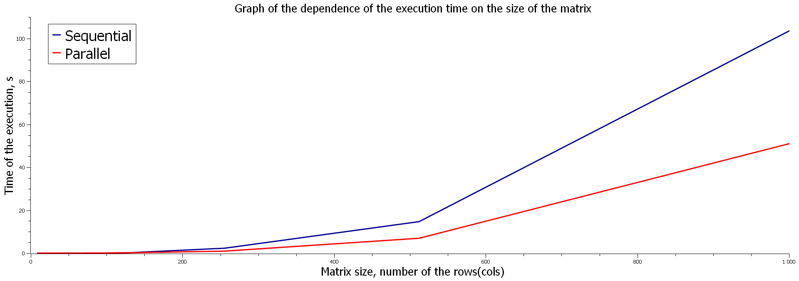

# Алгоритм Штрассена для умножения матриц

## Описание

Этот проект содержит реализацию алгоритма Штрассена для умножения квадратных матриц. Алгоритм Штрассена представляет собой усовершенствование стандартного метода умножения матриц, которое позволяет сократить асимптотическую сложность вычислений с $O(n^3)$ до примерно $O(n^{2.81})$. В проекте представлены две версии алгоритма:
1. Последовательная версия.
2. Параллельная версия с использованием OpenMP для ускорения вычислений.

## Требования

- Компилятор с поддержкой C++17 или выше.
- Установленный OpenMP (обычно поддерживается большинством современных компиляторов, таких как GCC и Clang).
- CMake для сборки проекта.

## Сборка проекта

1. Склонируйте репозиторий:
   ```bash
   git clone git@github.com:Agustangel/Parallel-programming.git
   cd <repository-directory>
2. Создайте директорию сборки и сконфигурируйте проект:
    ```bash
    mkdir build
    cmake -B build/ -DCMAKE_BUILD_TYPE=Release
    cmake --build build/
    cd build
    make

## Сравнение последовательной и параллельной версий


